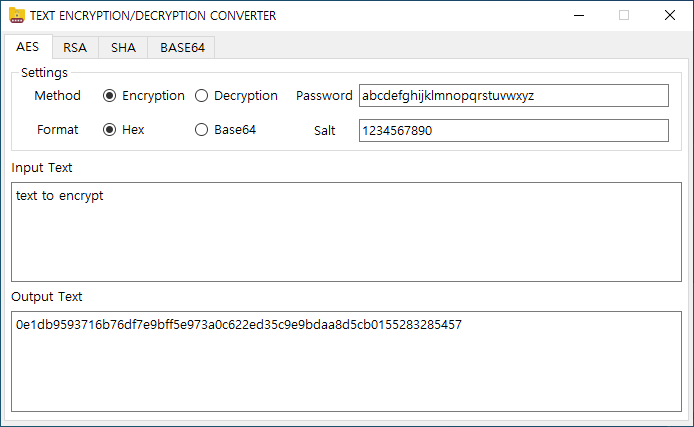
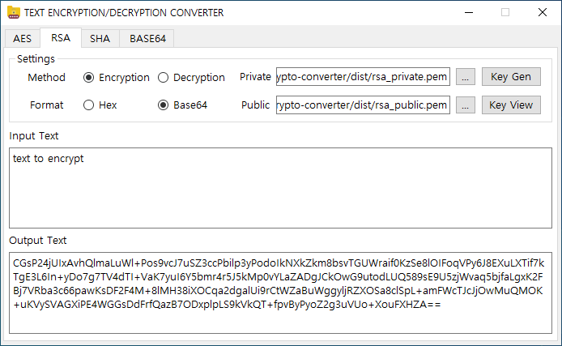
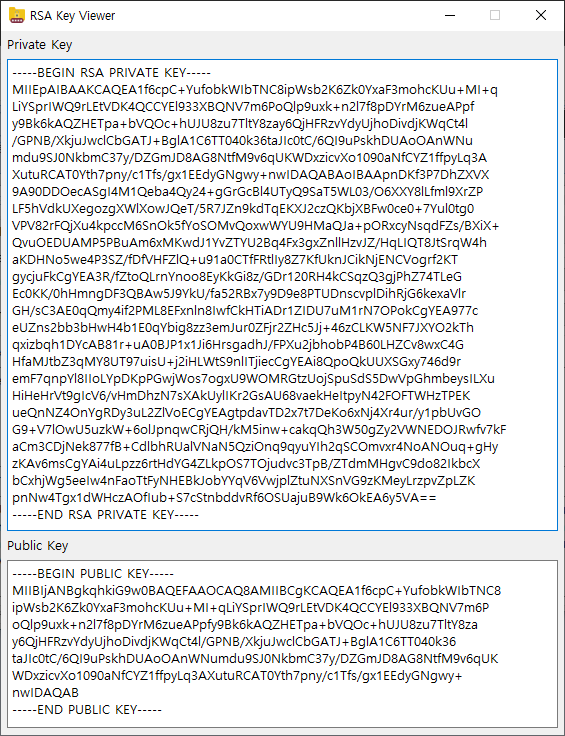
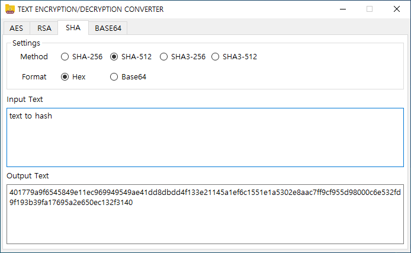
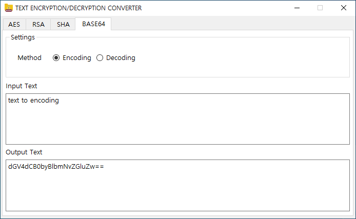

# Text Crypto Converter
This Python code is a program that encrypts and decrypts text using PyQt5.

Feature List
* AES-256 Encryption/Decryption
* RSA-1024 Encryption/Decryption and Key Generation (Private, Public)
* SHA Hashing (SHA-256, SHA-512, SHA3-256, SHA3-512)
* Base64 Encoding/Decoding

## AES Tab
### AES-256 Encryption/Decryption Mode

### Settings
- **Method**

	|    Method    |             Description              |
	|:------------:|:------------------------------------:|
	| `Encryption` |   AES-256 Encryption of Plain Text   |
	| `Decryption` | Decryption of AES-256 Encrypted Text |

- **Format**

	|  Format  |                Description                 |
	|:--------:|:------------------------------------------:|
	|  `Hex`   | Input or Output Text in Hexadecimal Format |
	| `Base64` |   Input or Output Text in Base64 Format    |
	
- **Password** : Password of **hashlib.pbkdf2_hmac(SHA-512)** function used when generating **AES Key**
- **Salt** : Salt of **hashlib.pbkdf2_hmac(SHA-512)** function used when generating **AES Key**

## RSA Tab
### RSA-2048 Encryption/Decryption Mode

### Settings
- **Method**

	|    Method    |              Description              |
	|:------------:|:-------------------------------------:|
	| `Encryption` |   RSA-2048 Encryption of Plain Text   |
	| `Decryption` | Decryption of RSA-2048 Encrypted Text |

- **Format**

	|  Format  |                Description                 |
	|:--------:|:------------------------------------------:|
	|  `Hex`   | Input or Output Text in Hexadecimal Format |
	| `Base64` |   Input or Output Text in Base64 Format    |

- **Private** : Private key file path for RSA-2048 ( **...** : Private PEM File Dialog)
- **Public** : Public key file path for RSA-2048 ( **...** : Public PEM File Dialog)
- **Key Gen** : Generate a new default key file for RSA-2048
	
	* Private Key : rsa_private.pem
	* Public Key : rsa_public.pem
- **Key View** : Set private key and public key viewer

  

## SHA Tab
### SHA Algorithm Hasing Mode

### Settings
- **Method**
	
	|   Method   |          Description           |
	|:----------:|:------------------------------:|
	| `SHA-256`  | SHA-256 Hashing of Input Text  |
	| `SHA-512`  | SHA-512 Hashing of Input Text  |
	| `SHA3-256` | SHA3-256 Hashing of Input Text |
	| `SHA3-512` | SHA3-512 Hashing of Input Text |
	
- **Format**

	|  Format  |            Description            |
	|:--------:|:---------------------------------:|
	|  `Hex`   | Output Text in Hexadecimal Format |
	| `Base64` |   Output Text in Base64 Format    |
	

## BASE64 Tab
### Base64 Encoding/Decoding Mode

### Settings
- **Method**
	
	|   Method   |          Description          |
	|:----------:|:-----------------------------:|
	| `Encoding` | Base64 Encoding of Input Text |
	| `Decoding` | Base64 Decoding of Input Text |
